# Embedded Evaluation: Stata Tools for Applied Research and Evaluation

 
---

## 1. The Marketable Hook: The Embedded Evaluator
Updated objective/framing: 
Instead of positioning the book as a standard Stata software manual, we reposition it around the identity of the **Embedded Evaluator**—the practitioner-researcher who serves as a strategic partner inside foundations, think-tanks, non-profit programs, and public agencies doing applied, actionable, and accessible research and evaluation work in real-world program and policy evaluation contexts often employing researcher-practitioner approaches.  The book should embrace this view point of a research building stata-centric workflows and bootstrapped , free/low cost tools. The toolkit is stata centric but embraces llm tech carefully and ethically, tools to visualize results dynamically/interactively, and tools to quickly scarpe public data or survey data software (via apis, etc). 

### Core Narrative Hook
*   **The Dilemma:** Academic textbooks teach econometrics under the assumption of clean, static datasets, infinite compute time, and neutral political settings. Real-world evaluation is the opposite: data arrives late as forty fragmented, unharmonized spreadsheets, the program director needs an answer by Friday morning, and the results carry high funding and policy stakes.
*   **The Stance (BLUF):** This book bridges the gap between causal econometrics and public sector data engineering. It demonstrates how to use Stata as a command center to ingest messy data, run modern causal models (staggered DiD, synthetic controls, debiased ML), verify algorithmic fairness, and output interactive, self-contained reports that require no server infrastructure.

### The Client-Empathy Lens and Client-Facing Toolkit
A key thesis of this revision is the shift from *evaluator as auditor* to *evaluator as empathetic partner*. Causal rigor is useless if the client rejects the findings due to a defensive reaction to "bad news." This book introduces a client-facing toolkit that leverages Stata-centric automation to build trust:
*   **Staff Literacy:** Using Stata's `codebook` and `labelbook` output to generate interactive, plain-language data dictionaries so front-line program staff understand *why* data quality matters.
*   **Quick Wins:** Automating the "Monday Morning Update" to provide program managers with operational metrics (using `collect` and `putexcel`) before causal findings are finalized.
*   **Collaborative Logic Modeling:** Using Stata-orchestrated LLM checklists (`evalpreflight`) to de-risk logic models and establish measurement plans *with* the client before data collection begins.
*   **Empathic Survey Design:** Implementing automated survey suite tools (`surveytracker`, `likertscale`) to minimize respondent burden and present clean, scannable data summaries that respect the client's time.
*   **Source Transparency:** Utilizing data source tagging (`srctag`, `srcfind`) to prove variable lineage to skeptical agency clients, showing exactly how raw administrative databases map to final policy findings.

---

## 2. Refined Chapter-by-Chapter Outline

The book is structured into five parts, moving from foundational environments to survey instrumentation, complex causal analysis, data governance, dynamic reporting, and custom package development. 

```mermaid
graph TD
    classDef part fill:#14776A,stroke:#fff,stroke-width:2px,color:#fff;
    classDef chap fill:#FBF1DF,stroke:#B5651D,stroke-width:1px,color:#7A3E0E;
    
    Part1[Part I: The Embedded Stack]:::part --> Ch1(Chapter 1: Strategic Evaluation & MDE):::chap
    Part1 --> Ch2(Chapter 2: High-Performance Setup):::chap
    Part1 --> Ch3(Chapter 3: Governed AI Integration):::chap
    
    Part2[Part II: Data Engineering & Surveys]:::part --> Ch4(Chapter 4: Ingestion & API Pipelines):::chap
    Part2 --> Ch5(Chapter 5: Harmonization & Tagging):::chap
    Part2 --> Ch6(Chapter 6: Survey Suite & Nonresponse):::chap
    Part2 --> Ch7(Chapter 7: Ethics, Privacy & Synthetic Data):::chap
    
    Part3[Part III: The Causal Frontier]:::part --> Ch8(Chapter 8: Modern Staggered DiD):::chap
    Part3 --> Ch9(Chapter 9: Cutoffs & ITS):::chap
    Part3 --> Ch10(Chapter 10: Synthetic Controls & SDID):::chap
    Part3 --> Ch11(Chapter 11: ML & Algorithmic Fairness):::chap
    Part3 --> Ch12(Chapter 12: Cost-Effectiveness & ROI):::chap
    
    Part4[Part IV: Communication]:::part --> Ch13(Chapter 13: Tuftean Visualizations):::chap
    Part4 --> Ch14(Chapter 14: Offline Web Portals):::chap
    
    Part5[Part V: Tool Building]:::part --> Ch15(Chapter 15: Scripts to Packages):::chap
    Part5 --> Ch16(Chapter 16: Mata-er Scalability):::chap
```



### Part I: The Embedded Stack: Principles, Speed, and Environment
*   **Chapter 1: Strategic Evaluation in Implementation Science**
    *   *Section 1.1: The Practitioner-Researcher Relationship*
        *   Managing Power Dynamics in Embedded Evaluation (Data ownership, "bad news" problem)
        *   Building Evaluation Literacy with Staff (Data dictionaries, `codebook, compact`, `labelbook`)
        *   *Applied Example:* From a Funder's Question to a One-Page Answer (using `convertanything`, county rurality crosswalk, `reachcheck`)
        *   *Ado-file Idea:* `evalaudit` (audits data-sharing agreements, compliance, mandates)
    *   *Section 1.2: Implementation Science Principles in Practice*
        *   Iterative Evaluation: The PDSA Cycle in Stata (standardized pipelines `100_` to `600_`)
        *   *Visualization Callout:* The PDSA Run Chart (`xline()` annotations)
        *   Contextualizing the Evidence: Using CFIR to Code Site Characteristics
        *   *Ado-file Idea:* `fidplot` (graphs site-level fidelity metrics against benchmarks)
    *   *Section 1.3: Stata as the Central Evaluation Brain*
        *   Bypassing Excel: The Risky Habit of Spreadsheet Analysis
        *   *Ado-file Idea:* `projectbuilder` (standardizes workspace directories, folder setups, and master controls; with a minor note on `driveuse` for cross-platform path resolution).
    *   *Section 1.4: Designing for Detectable Effects: Power and the MDE*
        *   Power for cluster designs, design effects, and `clustersampsi` logic
        *   *Visualization Callout:* The Power Curve (power vs. sample size/clusters)
    *   *Section 1.5: Pre-Registration and the Analysis Plan* (hypotheses, primary outcomes, confirmatory vs. exploratory)
*   **Chapter 2: Setting Up a High-Performance Environment**
    *   *Section 2.1: The Speed Revolution: `ftools` and `gtools`*
        *   Benchmarking `gcollapse` vs. `collapse` and multi-way fixed effects with `reghdfe`
        *   Large Data Workflows without MP (memory limits, `keep`/`drop` early, `compress`)
        *   *Ado-file Idea:* `gtools_audit` (projects speedups from `gtools`/`ftools` replacements)
    *   *Section 2.2: Monitoring Real-Time Participation*
        *   REDCap/Qualtrics APIs, response rates, and attrition alerts
        *   Early Warning Systems: Statistical Process Control (SPC) (control charts)
        *   *Visualization Callout:* The Control Chart (time-series, upper/lower control limits)
        *   *Ado-file Idea:* `reachcheck` (compares demographics to target population, calculates weights)
    *   *Section 2.3: Communicating with Funders and Stakeholders*
        *   Automating the Appendix (using Stata's `collect` for secondary tables)
        *   *Ado-file Idea:* `fundertable` (wrapper for `collect`/`putexcel` for executive summaries)
    *   *Section 2.4: Integrating AI: The LLM CLI Bridge*
        *   Prompt Engineering for Evaluators, shell API calls, API key hygiene
        *   *Package Integration:* `Gemini-stata` (executing prompts from the command line)
*   **Chapter 3: The Careful Use of AI in Evaluation**
    *   *Section 3.1: Privacy First: What Never Leaves the Building* (FERPA/HIPAA, local Ollama models)
        *   *Ado-file Idea:* `ai_privacy_gate` (pre-flight check scanning for PII before transmission)
    *   *Section 3.2: Hallucination and the Verification Protocol* (gold-standard subset, Kappa threshold)
        *   *New Tool Integration:* `llmsieve` (LLM consensus and human-in-the-loop agreement auditor)
    *   *Section 3.3: Reproducibility of Stochastic Output* (pinning versions, temperature 0, response caching)
    *   *Section 3.4: Prompt Injection and Untrusted Text* (separating system instructions from data)
    *   *Section 3.5: A Model-Agnostic Posture* (provider-agnostic wrappers)
    *   *Applied Example:* Coding 5,000 Progress Notes Without Getting Burned (privacy gate, 150 gold standard, Kappa check, caching, disclosure)

### Part II: Data Engineering and Survey Instrumentation
*   **Chapter 4: Advanced Data Ingestion & API Pipelines**
    *   *Section 4.1: Generalizing the API Handshake in Stata*
        *   Designing robust Stata-Python workflows for generic web APIs
        *   Handling authorization headers (OAuth2, Bearer tokens), query parameters, and pagination
        *   Request throttling, rate limiting, and defensive HTTP parsing (`jsonio` + `requests` in Python)
        *   *Applied Case Study:* Connecting to the **Zelma.ai API** to scrape and ingest district school test score benchmarks
        *   *Ado-file Idea:* `redcap_pull` (JSON parsing and variable labeling wrapper)
    *   *Section 4.2: Unstructured Data: The AI Bridge*
        *   Sentiment Analysis as an Evaluation Tool
        *   *Ado-file Idea:* `text2vars` (extracts indicators from progress notes with verification hooks)
    *   *Section 4.3: Measurement: From Items to Reliable Scales* (Cronbach's alpha, EFA/CFA, sem, IRT)
*   **Chapter 5: Harmonization, Master Data Management & Source Tagging**
    *   *Section 5.1: Merging the Unmergable* (probabilistic matching, string distance, Jaro-Winkler)
        *   Spatial Joining without GIS (lat/long nearest-neighbor, Haversine distance)
        *   *Applied Example:* Linking Two Agency Files With No Common ID
        *   *Ado-file Idea:* `fuzzymatch_pro` (reclink extension, Jaro-Winkler, Merge Quality Report)
    *   *Section 5.2: Data Governance in Multi-Dataset Environments*
        *   The lineage problem: tracking variable history across combined agency databases (TEA, TWC, etc.)
        *   Standardizing source tags inside variable characteristics
        *   *Package Integration:* `srctag` (data source tagging) and `srcfind` (source searching library auditor)
    *   *Section 5.3: Longitudinal Panel Construction* (wide reshaping, lineage crosswalks)
        *   Transition Matrices: Visualizing Participant Movement (tracking states across periods)
        *   *Visualization Callout:* The Sankey Flow (using `statashiny` widget)
        *   *Ado-file Idea:* `trackflow` (Sankey flow-data shaper)
    *   *Section 5.4: Missing Data and Multiple Imputation* (diagnosing patterns, MAR, `mi set`/`impute`)
        *   *Visualization Callout:* The Missingness Map (heatmap of missing variables)
    *   *Section 5.5: Weighting for Representativeness* (svyset, post-stratification, raking)
*   **Chapter 6: Modern Survey Instrumentation & Nonresponse Bias**
    *   *Section 6.1: API Ingestion & Metadata Automation*
        *   Qualtrics and Google Forms APIs; pulling raw columns and value metadata into Stata
        *   Mapping survey questions directly to Stata variable characteristics (`char define`)
        *   *Package Integration:* `surveytracker` (longitudinal item/construct tracker)
    *   *Section 6.2: Auto-Encoding & Scale Simplification*
        *   Automating categorical string encoding and value labeling off platform metadata
        *   Calculating scale indices, Cronbach's alpha, and collapsed percent-agree variables
        *   *Package Integration:* `likertscale` (Likert scale auto-processor)
    *   *Section 6.3: Comprehensive Survey Bias Analysis*
        *   Item vs. Unit nonresponse diagnostics; modeling missingness patterns
        *   Calculating post-stratification and raking weights
        *   *Package Integration:* `nonresponse` (nonresponse bias auditor) and `loebias` (Level-of-Effort survey bias auditor)
    *   *Section 6.4: Graphing Surveys with Nick Cox's Diagnostics*
        *   Tufte-style survey visualization tips using `statplot`, `catplot`, and inline `sparkta2`
*   **Chapter 7: Ethics, Privacy, and Synthetic Data**
    *   *Section 7.1: The Privacy-Utility Tradeoff* (quasi-identifiers, ZIP, birth date, sex)
        *   Measuring Re-identification Risk: k-Anonymity and l-Diversity
        *   *Ado-file Idea:* `riskscan` (scans dataset for potential Quasi-Identifiers and calculates risk metrics)
    *   *Section 7.2: Synthetic Data Generation* (simulate, AI-driven synthesis, statistical fidelity validation)
        *   *Ado-file Idea:* `synthgen` (integrates with Python to generate synthetic cohorts)

### Part III: The Causal Frontier: Non-Standard Policy Analysis
*   **Chapter 8: Modern Difference-in-Differences**
    *   *Section 8.1: The Revolution in Staggered Adoption* (TWFE bias, negative weights, staggered timing)
        *   The Forbidden Regression: Why Simple Interactions Aren't DiD (contaminated controls)
        *   *Ado-file Idea:* `did_selector` (analyzes treatment timing and suggests `csdid`, `jwdid`, or `did2s`)
    *   *Section 8.2: Implementing `csdid` and `jwdid`*
        *   Event-Study Plots and Pre-Trends
        *   *Visualization Callout:* The Event-Study Plot (relative event time, CIs, zero lines)
        *   Sensitivity Analysis: `honestDiD` and Oster Bounds (`psacalc` omitted-variable bias)
*   **Chapter 9: Regression Discontinuity and Interrupted Time Series**
    *   *Section 9.1: When a Rule Creates a Natural Experiment* (sharp/fuzzy RD, rdrobust, bandwidth)
        *   Validity checks: manipulation of the running variable (`rddensity`), covariate continuity
        *   *Visualization Callout:* The RD Plot (binned means, fitted curves on sides of cutoff)
    *   *Section 9.2: Interrupted Time Series for Single-Site Rollouts* (ITS, level/slope changes, comparative ITS)
*   **Chapter 10: Synthetic Controls and Matrix Completion**
    *   *Section 10.1: The Synthetic Control Method (`synth`)*
        *   In-space and In-time Placebo Tests (falsification tests)
    *   *Section 10.2: Synthetic Difference-in-Differences (`sdid`)* (unit and time weights)
        *   *Ado-file Idea:* `sdid_viz` (plotting command overlaying weights and counterfactual trends)
*   **Chapter 11: Machine Learning and Algorithmic Fairness in Targeting**
    *   *Section 11.1: Targeting Models with Lasso and Elastic Net* (cvlasso, train/test split)
        *   Ethics of Prediction: Bias Detection in Targeting (fairness checks, false positive/negative balance)
        *   *New Tool Integration:* `faircheck` (algorithmic fairness auditor)
    *   *Section 11.2: Random Forests in Stata* (interactions, variable importance, partial-dependence plots)
    *   *Section 11.3: Double/Debiased Machine Learning (`ddml` + `pystacked`)*
        *   *Ado-file Idea:* `cate_explorer` (surfaces Conditional Average Treatment Effects for managers)
*   **Chapter 12: Cost-Effectiveness and Return on Investment**
    *   *Section 12.1: The Question Funders Directly Ask* (cost-effectiveness, ROI, perspective-based accounting)
        *   Monte Carlo simulations of ROI, discounting future benefits
        *   *Visualization Callout:* The Tornado / Sensitivity Chart (tornado diagram of influence)
        *   *Ado-file Idea:* `roisim` (takes effect, standard error, cost table, and runs Monte Carlo simulation of ROI)

### Part IV: High-Impact Communication: Visualizations and Portals
*   **Chapter 13: Innovative and Diagnostic Visualizations**
    *   *Section 13.1: Sparklines and Micro-charts* (portfolios, inline graphics)
        *   *Package Integration:* `sparkta2` (high-density inline trend sparklines)
        *   Maximizing the Data-to-Ink Ratio (Tuftean design, stripping chartjunk, accessibility)
    *   *Section 13.2: Advanced Coefficient Plots* (`coefplot`, `marginsplot`, predictive margins)
        *   *Package Integration:* `statplot` (Tufte-inspired statistical plotting)
        *   *Visualization Callout:* The Small-Multiple Coefficient Plot (by outcome/subgroup)
*   **Chapter 14: Dynamic Reporting and Self-Contained Web Portals**
    *   *Section 14.1: Dynamic HTML with `webdoc`* (`webdoc2` Bootstrap-5 compilation wrapper)
        *   The Self-Contained Project Portal (`statashiny` standalone HTML interactive widgets)
        *   *Applied Example:* From Do-File to Shareable Project Portal (using projectbuilder, statashiny, webdoc2, wdiframe)
    *   *Section 14.2: AI-Assisted Narrative Generation & Alignment Tools*
        *   The 'So What?' Test (finding key outcomes)
        *   *Ado-file Idea:* `stata2brief` (generates one-page summary briefs via API)
        *   *New Tool Integration:* `evalpreflight` (Evaluator Pre-flight & Adversarial Review Checklist Generator)

### Part V: Building Tools that Mata-er: Custom Development
*   **Chapter 15: From Scripts to Systems**
    *   *Section 15.1: From Scripts to Systems* (sharing team tools, refactoring)
        *   The 'Package' Mindset: Versioning Internal Tools (`_codeshare` suite, GitHub installation, metadata files)
        *   *Applied Example:* Turning a One-Off Script Into a Shared Tool (the `dsload` story)
        *   *Package Integration:* `usepackage` (auto-dependency resolution) and `writeinput` (writing memory to self-contained test scripts)
    *   *Section 15.2: Writing Help Files (`.sthlp`, SMCL markup, Viewer rendering)*
*   **Chapter 16: Scalability and the Stata-Mata-Python Trifecta**
    *   *Section 16.1: Introduction to Mata for Evaluators* (matrix operations, compiled speed)
        *   The Trifecta Workflow: Stata, Mata, and Python (Stata for data, Mata for matrix, Python for web/APIs/scrapers/LLMs)
        *   *Package Integration:* `lstrfun` (macro manipulation via Mata)
        *   *Ado-file Idea:* `mata_bench` (benchmarks Stata loops vs. Mata implementation)

---

## 3. Technical Specifications for New/Integrated Stata Tools

### Tool 1: `loebias` (Level-of-Effort Nonresponse Bias Auditor)

#### Syntax & Options
```stata
loebias varlist [if] [in] [weight] , contact(varname) [options]
```

*   `contact(varname)`: (Required) Integer variable indicating the contact attempt number (e.g., 1, 2, 3, ..., $K$).
*   `threshold(#)`: Stabilization threshold (absolute change in cumulative estimate). Default is `0.02`.
*   `ci`: Display confidence intervals on the generated stabilization plot.
*   `graph`: Produce a cumulative line graph showing the estimate's path toward stabilization.
*   `saving(filename [, replace])`: Save the cumulative dataset containing attempt-level estimates, standard errors, and cumulative sample sizes.

#### Technical Implementation Details
`loebias` calculates the cumulative weighted mean (or proportion) of each variable in `varlist` for all observations reached *up to* contact attempt $k \in [1, K]$.
1.  **Mathematical Logic:** Let $Y$ be the outcome of interest, and $C_i$ be the number of contact attempts required to reach respondent $i$. The cumulative estimate at attempt $k$ is:
    \[\bar{Y}_k = \frac{\sum_{i: C_i \le k} w_i Y_i}{\sum_{i: C_i \le k} w_i}\]
    Where $w_i$ is the survey weight.
2.  **Trend Test:** Runs a Wald test for trend across the contact waves to identify if early responders differ significantly from late responders:
    \[Y_i = \beta_0 + \beta_1 C_i + \epsilon_i\]
    Testing $H_0: \beta_1 = 0$ using clustered standard errors where appropriate.
3.  **Mata Optimization:** The accumulation loop is written in Mata to handle large survey portfolios ($N > 100,000$ observations across dozens of variables) instantly.

---

### Tool 2: `faircheck` (Algorithmic Fairness Auditor)

#### Syntax & Options
```stata
faircheck depvar predvar [if] [in] , group(varname) [options]
```

*   `group(varname)`: (Required) Categorical variable defining protected subgroups (e.g., race, gender, geographic region).
*   `threshold(#)`: Cut-off threshold for continuous predictions (probabilities). Default is `0.5`.
*   `reference(# | string)`: Subgroup value or label to serve as the baseline comparison. Defaults to the group with the highest selection rate.
*   `disparity(#)`: Adverse impact threshold. Default is `0.80` (implementing the EEOC's four-fifths rule).
*   `plot`: Generates a bar chart comparing selection rates and true positive rates across groups.

#### Technical Implementation Details
`faircheck` evaluates classification performance metrics across groups. For each group $g$:
*   **Selection Rate (Demographic Parity):** $\mathbb{P}(\hat{Y} = 1 | G = g)$
*   **True Positive Rate (Equalized Odds - TPR):** $\mathbb{P}(\hat{Y} = 1 | Y = 1, G = g)$
*   **False Positive Rate (Equalized Odds - FPR):** $\mathbb{P}(\hat{Y} = 1 | Y = 0, G = g)$
*   **Positive Predictive Value (Predictive Parity - PPV):** $\mathbb{P}(Y = 1 | \hat{Y} = 1, G = g)$

Disparity ratios are calculated as:
\[\text{Ratio}_g = \frac{\text{Metric}_g}{\text{Metric}_{\text{reference}}}\]

---

### Tool 3: `llmsieve` (LLM Consensus and Gold-Standard Auditor)

#### Syntax & Options
```stata
llmsieve varlist [if] [in] , generate(newvar) [options]
```

*   `varlist`: Categorical variables containing text classification tags generated by different LLMs or distinct prompt configurations (e.g., `gemini_tag claude_tag gpt_tag`).
*   `generate(newvar)`: (Required) Base name for the generated audit variables:
    *   `newvar_consensus`: The majority-vote category. If a tie occurs, it is marked as missing (`.`) or defined by priority.
    *   `newvar_agreement`: Proportion of models in agreement (range $[0, 1]$).
    *   `newvar_entropy`: Normalized Shannon Entropy measuring coding uncertainty.
*   **Options:**
    *   `gold(varname)`: The variable containing the human-coded "gold standard" truth. When specified, `llmsieve` switches from consensus-only to benchmarking mode, calculating accuracy, precision, recall, and Cohen's $\kappa$ (or Fleiss' $\kappa$ if comparing multiple LLMs to the human standard).
    *   `threshold(#)`: Flag cases where agreement falls below this proportion. Default is `0.67`.
    *   `flag(varname)`: Create a dummy variable flagging cases below the agreement threshold for human adjudication.
    *   `priority(varname)`: Tie-breaker model variable (e.g., trust Claude over Llama).
    *   `kappa`: Computes Fleiss' Kappa coefficient for inter-rater agreement.

#### Technical Implementation Details
1.  **Agreement Calculation:** For each observation $i$ with $M$ model variables:
    \[\text{Agreement}_i = \frac{\max(count(v_{1i}, \dots, v_{Mi}))}{M}\]
2.  **Entropy Calculation:** Measures the dispersion of classifications across categories:
    \[H_i = -\frac{1}{\log(M)} \sum_{c=1}^{C} p_{ic} \log(p_{ic})\]
    Where $p_{ic}$ is the proportion of models that coded observation $i$ as category $c$. $H_i = 0$ represents unanimous consensus; $H_i = 1$ represents complete disagreement.
3.  **Fleiss' Kappa:** Computes the overall reliability of the LLM team, checking if the agreement is better than random chance.

---

### Tool 4: `evalpreflight` (Evaluator Pre-flight & Adversarial Review Checklist Generator)

#### Syntax & Options
```stata
evalpreflight using filename.txt [if] [in] , mode(string) generate(newfile.md) [options]
```

*   `using filename.txt`: (Required) Path to the text input file containing the document to review (e.g., draft evaluation report, draft theory of change, data dictionary, program description).
*   `mode(string)`: (Required) Type of review to run:
    *   `preflight`: Logic Model & Theory of Change pre-flight check. Focuses on identifying measurement opportunities, potential public data sources (e.g. FRED, Census), causal mechanisms (DAG pathways), confounders, and sources of selection bias.
    *   `blindspot`: Adversarial review of an evaluation product/report. Identifies logical gaps, alternative explanations, statistical caveats, and potential sources of cognitive or reporting bias.
*   `generate(newfile.md)`: (Required) Path to the Markdown file (`.md`) to write the audit results.
*   `model(string)`: LLM model to use (default is `gemini`).
*   `dag`: In `preflight` mode, explicitly formats causal loops and confounding mechanisms into raw text representations and a compiled `mermaid` block for visual integration.
*   `replace`: Overwrite the existing markdown file if it exists.

#### Technical Implementation Details
`evalpreflight` acts as the Stata orchestrator for a secure Python API script.
1.  **Stata-Python Seam:** The ado-file packages the input document, injects it into a structured prompt based on the chosen mode, makes the API call via Python's SDK, and writes the returned Markdown response to disk.
2.  **Prompt Constraints (preflight):** Instructs the model to return a structured checklist:
    *   *Section 1: Causal Linkages & Confounders* (merging concepts into a Mermaid graph syntax).
    *   *Section 2: Measurement Gaps* (matching constructs to Stata-native measurement tools like alpha/IRT).
    *   *Section 3: Public Data Matches* (mapping county/state variables to Census or FRED codes).
3.  **Prompt Constraints (blindspot):** Instructs the model to act as a hostile peer reviewer:
    *   *Section 1: Alternative Explanations* (what else could explain this correlation?).
    *   *Section 2: Selection Bias Alerts* (how might the sample be self-selected?).
    *   *Section 3: Technical Caveats* (suggesting sensitivity checks like Oster bounds or placebos).

---

### Tool 5: `surveytracker` (Longitudinal Survey Instrument and Construct Tracker)

#### Syntax & Options
```stata
surveytracker [varlist] [if] [in], excel(filename.xlsx) wave(string) [options]
```

*   `varlist`: List of variables currently in memory to inventory. Defaults to all variables.
*   `excel(filename.xlsx)`: (Required) Path to the running Excel spreadsheet where the longitudinal instrument history is maintained.
*   `wave(string)`: (Required) Label for the current survey wave (e.g., "2025 Wave 1", "T2").
*   `constructs(varname)`: Variable in memory containing the construct names associated with each variable.
*   `sheet(string)`: Name of the sheet inside the Excel workbook. Defaults to "Survey_Inventory".
*   `replace`: Overwrites the sheet if it already exists (useful for re-runs).

---

### Tool 6: `likertscale` (Scale Processing and Collapsing Automator)

#### Syntax & Options
```stata
likertscale varlist [if] [in], generate(newvar) [options]
```

*   `varlist`: Variables containing the Likert scale items (must share the same value label coding).
*   `generate(newvar)`: (Required) Base name for the generated index variables.
    *   Creates `newvar_mean`: The row-wise average index score.
    *   Creates `newvar_agree`: A collapsed percent-agree indicator if the `agree` option is specified.
*   **Options:**
    *   `agree`: Generates collapsed "Percent Agree" (top-two box) variables for each item in the list, where the value is set to 1 if the respondent selected "Agree" or "Strongly Agree" (or the top-two categories in the label set), and 0 otherwise.
    *   `scale(#)`: Points on the Likert scale. Defaults to `5`. Auto-calculates thresholds for the top-two box based on the scale points (e.g., $\ge 4$ on a 5-point scale, $\ge 6$ on a 7-point scale).
    *   `alpha`: Automatically runs Cronbach's alpha and prints scale reliability statistics in the console, saving `r(alpha)` in memory.
    *   `label`: Auto-labels the collapsed variables with "Percent Agree: [original label text]".

---

### Tool 7: `nonresponse` (Comprehensive Survey Nonresponse Bias Suite)

#### Syntax & Options
```stata
nonresponse [varlist] [if] [in], frame(filename.dta) id(varname) [options]
```

*   `varlist`: Variables to audit for item-level nonresponse. If empty, the command defaults to auditing unit-level nonresponse only.
*   `frame(filename.dta)`: (Required) Path to the sampling frame or population dataset (containing the universe of individuals who were sent the survey).
*   `id(varname)`: (Required) Unique identifier variable present in both the response data and the sampling frame.
*   `item`: Runs item-level missingness diagnostics on the specified `varlist`.
*   `unit`: Runs unit-level nonresponse bias checks comparing respondents to the overall frame population.
*   `rake(varlist)`: Calculates raking (post-stratification) weights based on frame characteristics (e.g., age, race, region) to correct for identified unit nonresponse.
*   `saving(filename.dta [, replace])`: Saves the combined response-frame dataset with newly calculated weights.

---

### Tool 8: `srctag` (Variable Source Tagging Utility)

#### Syntax & Options
```stata
srctag varlist [if] [in], source(string) [options]
```

*   `varlist`: Variables to tag with source metadata. Defaults to all variables.
*   `source(string)`: (Required) Identifier of the source agency or database (e.g., "TEA", "TWC", "Census_ACS_2024").
*   `table(string)`: Specific raw table or sheet name from which the variables originate.
*   `vintage(string)`: Data vintage or release year (e.g., "2025", "2024-Q3").
*   `note(string)`: Supplementary description stored in variable metadata.
*   `clear`: Strips all existing source tags from the specified variables.

#### Technical Implementation Details
`srctag` establishes data governance by storing source lineage directly inside Stata variable characteristics.
1.  **Characteristic Definitions:** For each variable $v$ in `varlist`, it sets:
    *   `char define v[src_name] "source_string"`
    *   `char define v[src_table] "table_string"`
    *   `char define v[src_vintage] "vintage_string"`
    *   `char define v[src_date] "current_date_string"`
2.  **Dataset-Level Lineage:** In addition to variable-level tags, it updates a dataset characteristic `_dta[src_manifest]` listing all distinct agencies represented in the dataset. This ensures that even after multiple merges, the composite dataset carries a clean audit trail.

---

### Tool 9: `srcfind` (Metadata Library Search Auditor)

#### Syntax & Options
```stata
srcfind [varlist] using path/ [if] [in] , [options]
```

*   `using path/`: (Required) Path to the data directory containing a library of `.dta` files to scan.
*   `source(string)`: Filter variables that match a specific source tag (e.g., source("TEA")).
*   `table(string)`: Filter variables that originate from a specific raw table.
*   `vintage(string)`: Filter variables by vintage year.
*   `query(string)`: Search term to match against variable names, labels, or question text characteristics.
*   `detail`: Prints full metadata details including value labels and notes for matched variables.

#### Technical Implementation Details
`srcfind` serves as the search engine for data warehouses in multi-dataset environments.
1.  **File Parsing:** The command loops through all `.dta` files in the specified directory. It reads only the dataset headers and variable descriptors using Mata's file parsing commands, which makes the scan extremely fast without loading large datasets into active memory.
2.  **Characteristic Reading:** Extracts characteristics (`src_name`, `src_table`, `src_vintage`, `question`) for each variable and evaluates matches against search parameters.
3.  **Audit Output:** Returns a structured list showing which `.dta` files contain matching variables, their labels, and their exact source lineage.

---

## 4. Pedagogical Movement and Style Guidelines

Following the writing styles of **Andrew Gelman** and **Nick Cox**, sections must move from intuitive narrative to concrete application, graphic diagnostic, code blocks, and finally statistical theory.

### Pedagogical Template (Example: Chapter 5 - Data Lineage & Client Empathy)

```
[Narrative: Intuition First] -> [Client-Empathy Use Case Box] -> [Diagnostic/Portal Picture] -> [Code Block] -> [Technical Details]
```

1.  **The Narrative:** Explain *why* data lineage is the bedrock of credibility. In policy research, the most dangerous question is: *"Where did this number come from?"* If the evaluator cannot trace a variable back to its raw table and vintage within seconds, trust with the agency client evaporates.
2.  **Client-Empathy Use Case Box:** 
    *   *Scenario:* A state workforce commission client is skeptical of an evaluation report showing that graduates of a training program are earning less than the state average. They suspect the data was joined incorrectly or comes from an outdated wage ledger.
    *   *The Lens:* Instead of debating, the evaluator runs `srcfind` on their warehouse folder directly in front of the client. The command immediately prints the exact variables used, showing they carry tags (`srctag`) linking them to the TWC's own *Q3 2025 Wage Ledger*. The client sees that the analysis respects their own data structures, neutralizing the adversarial dynamic and pivoting the conversation to program improvement.
3.  **Diagnostic/Portal Picture:** Embed a screenshot of the Stata Viewer rendering a variables metadata report showing custom source characteristics.
4.  **Code Block:** Provide copy-pasteable Stata code showing how to tag variables on ingestion and search a library of files.
5.  **Technical Details:** Explain the Mata-based dataset header parsing structures that make `srcfind` run efficiently without loading datasets.

---

## 5. Verification & Unit Testing Plan

To verify that the nine custom Stata tools function correctly and handle edge cases, we will implement the following automated test scripts:

### Automated Unit Tests
*   `test_loebias.do`: Simulates a survey dataset of $N=10,000$ observations with built-in nonresponse bias. Verifies that the Wald trend test returns correct significance statistics.
*   `test_faircheck.do`: Generates model predictions with known disparities and verifies that disparity ratio flags are triggered exactly when the ratio falls below the user-specified threshold.
*   `test_llmsieve.do`: Verifies consensus variables are generated correctly under agreement thresholds, and that accuracy metrics/Kappa are correctly printed when a `gold()` variable is specified.
*   `test_evalpreflight.do`: Verifies that Stata can successfully pass text to the LLM API and write a structured, non-empty Markdown checklist file containing required headings.
*   `test_surveytracker.do`: Simulates a multi-wave survey dataset. Verifies that `surveytracker` writes correct metadata to an Excel workbook, appends subsequent waves correctly, and flags item text discrepancies.
*   `test_likertscale.do`: Simulates Likert-scale items with varying response labels. Verifies that mean indices are computed correctly, "%-agree" variables collapse at the correct threshold, and Cronbach's alpha values are accurate.
*   `test_nonresponse.do`: Creates a simulated target frame and respondent file with built-in selection bias. Verifies that unit and item missingness tests identify the bias and that raking weights stabilize the demographics back to frame margins.
*   `test_srctag.do`: Simulates dataset merging. Verifies that variable-level characteristics (`src_name`, `src_table`, `src_vintage`) and dataset-level characteristics are preserved after merges.
*   `test_srcfind.do`: Populates a temporary directory with various dummy `.dta` files carrying different source tags. Verifies that `srcfind` correctly finds matching variables, filters by source and vintage, and fails gracefully when no files exist in the path.
